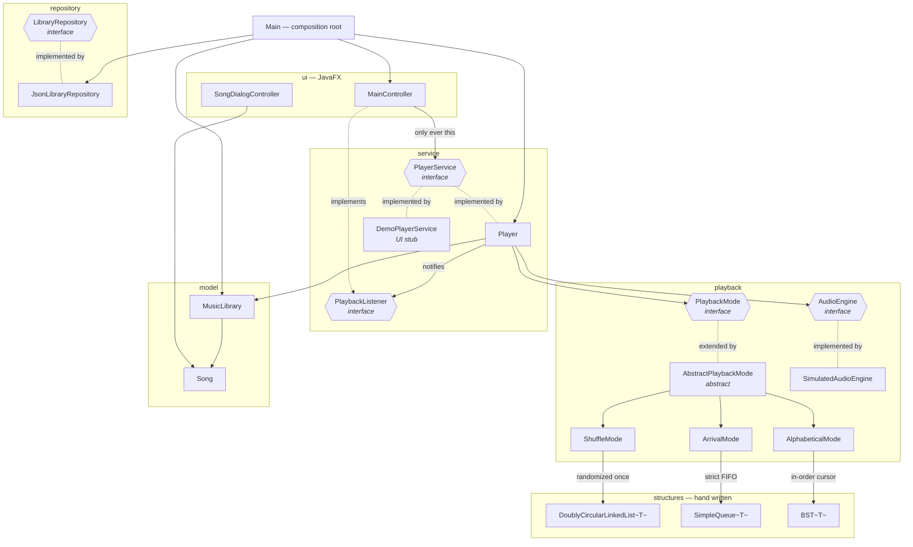
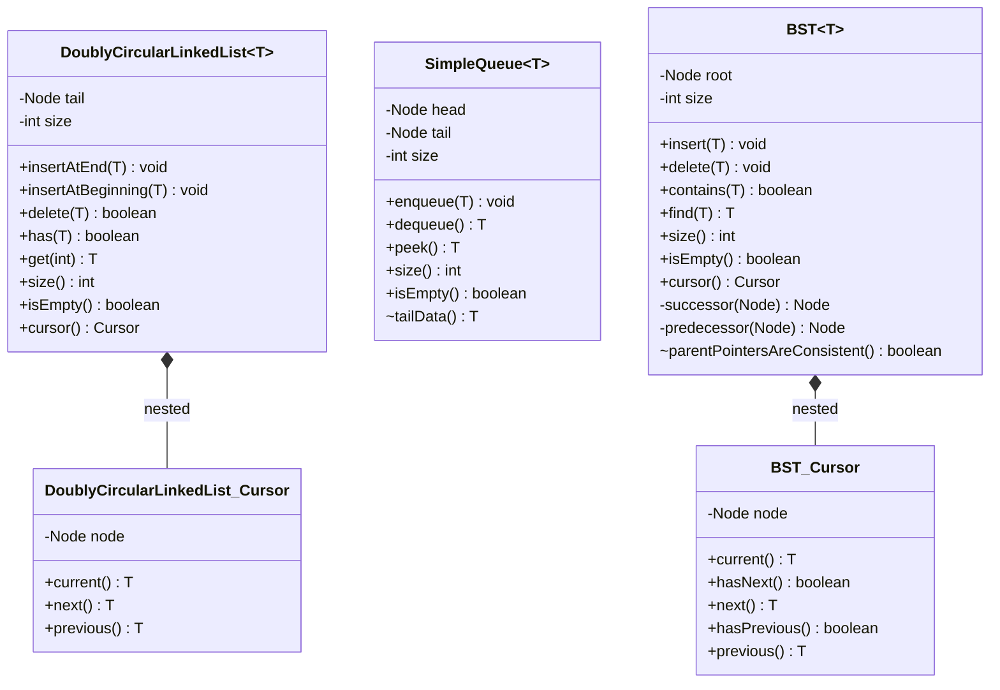
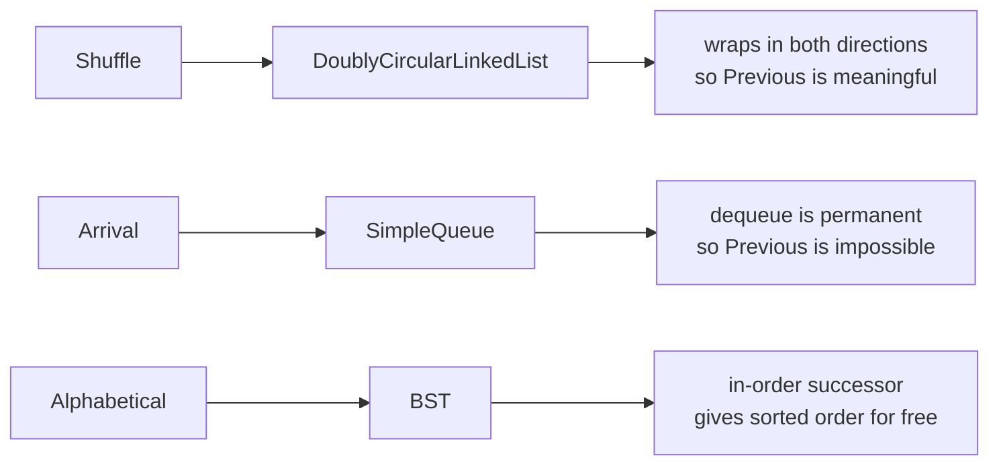

# Class diagram

The layering the project is built on, and the seams that make it defensible.

Read it in one sentence: **the UI talks only to `PlayerService`, `PlayerService` delegates
ordering to `PlaybackMode`, and each mode owns one hand-written structure.** Nothing above the
`playback` package ever names a structure.

## Layers and their seams

**The three dashed interface edges are the whole design.** `PlayerService` lets the UI be built
against a stub while the backend is written. `PlaybackMode` lets the same buttons produce three
different behaviours. `AudioEngine` lets the progress bar work without any audio file existing.

## The structures

Only these three classes are hand written. No `java.util` collection backs playback.

Three details a reviewer will look for:

- **`Node` is private in all three.** Navigation leaves through a `Cursor`, so no caller can
  reach into the structure. The two package-private methods (`tailData`,
  `parentPointersAreConsistent`) are test seams for invariants no behavioural assertion can
  observe — retention, and dangling parent pointers.
- **`BST` keeps a `parent` reference per node.** That is what makes `successor` and
  `predecessor` possible without flattening the tree into a list.
- **The two cursors differ deliberately.** `DoublyCircularLinkedList.Cursor` has no `hasNext`:
  a ring has no end. `BST.Cursor` has both, because an in-order walk does.

## Why each mode uses the structure it uses

The behaviour differences are not enforced by `if` statements anywhere. They fall out of the
structures: `hasPrevious()` returns `false` in arrival order because a queue genuinely cannot
go back, and the UI greys the button out from that value alone.

## Ownership of the catalogue

`MusicLibrary` is the single source of truth. Each mode **builds its own structure** from it on
`load()` and never re-reads it. Two consequences worth being able to state out loud:

1. `ArrivalMode` can drain its queue to empty without touching the catalogue.
2. A song added mid-session appears in playback only when a mode is next selected. That is a
   deliberate trade: reloading on every edit would reset the shuffle order mid-song and refill
   a queue the user had already played through.

`Main` is the composition root and the only place these pieces are assembled, so exactly one
`MusicLibrary` exists. A controller building its own would show a catalogue nobody loaded and
save edits nobody reads — silently.
